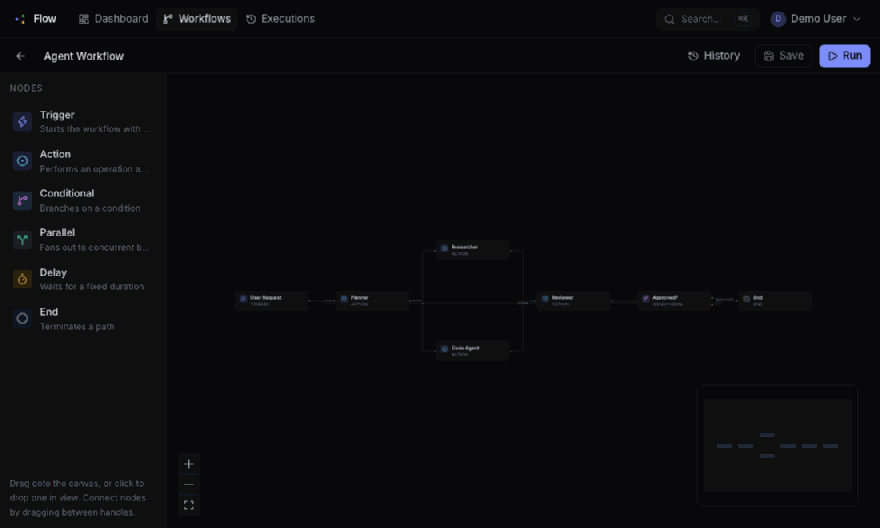
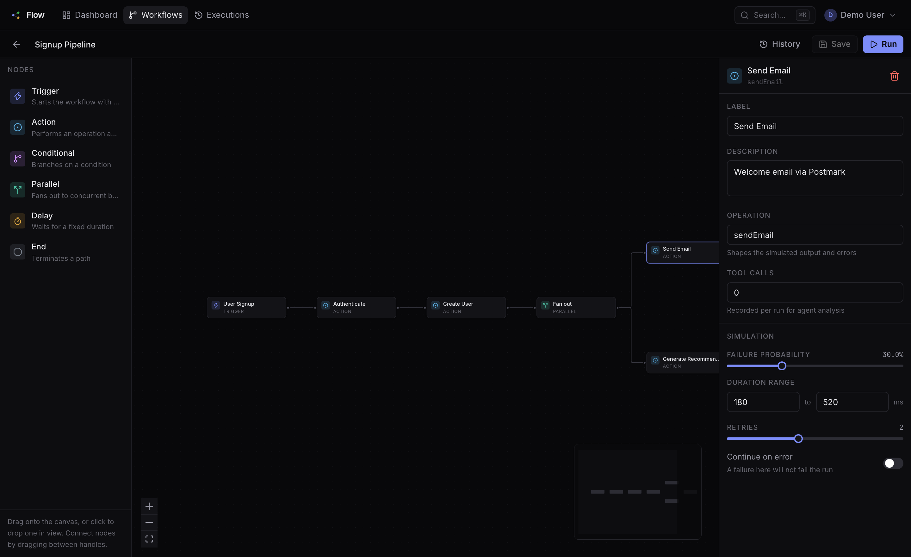
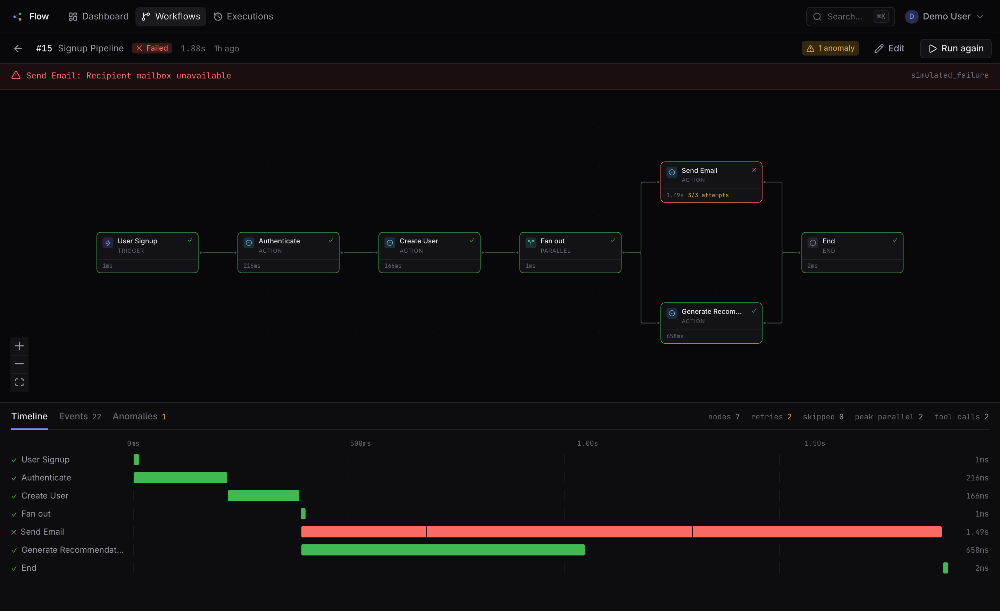
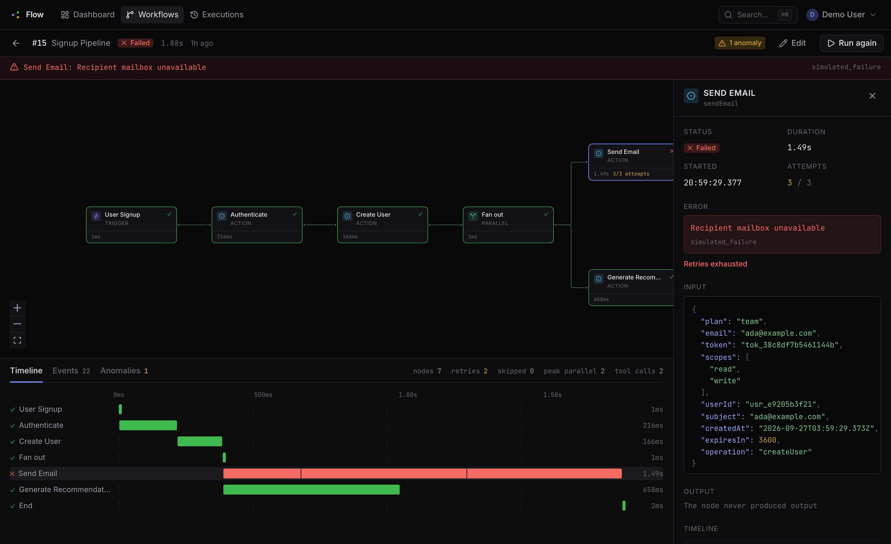
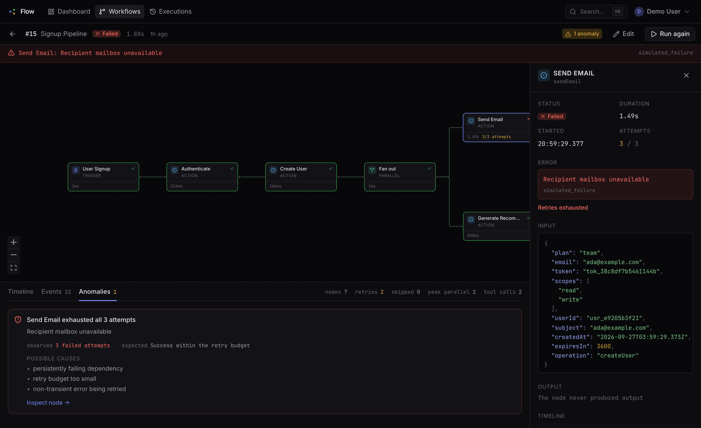
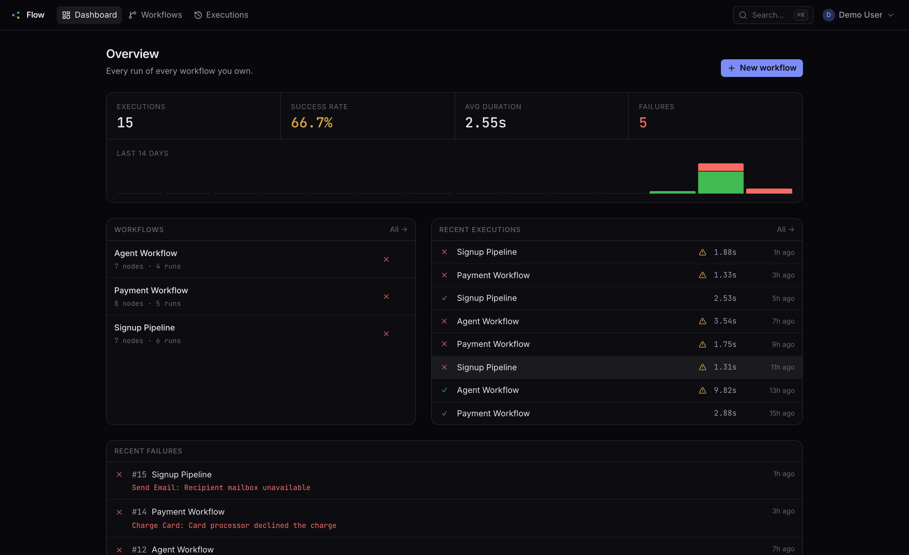
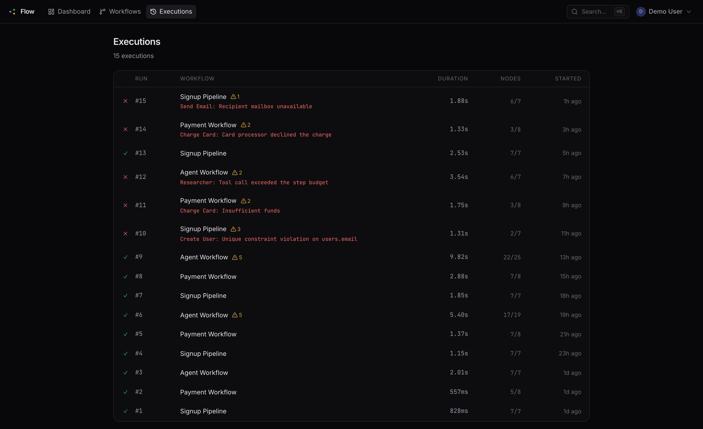
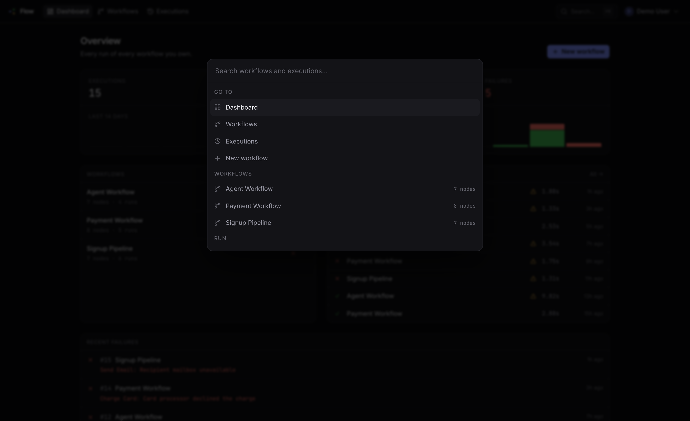
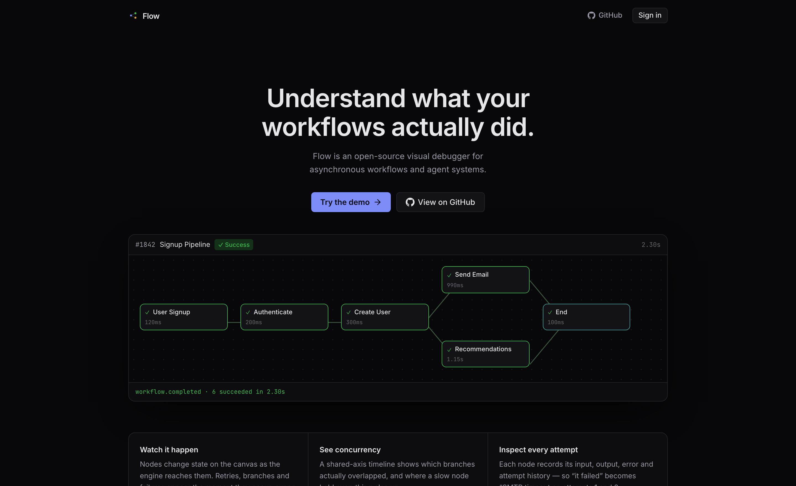

<div align="center">

# Flow

### Understand what your workflows actually did.

**Flow is an open-source visual debugger for asynchronous workflows and agent systems.**
Build a graph, run it, and watch every node resolve in real time — then open any past run
and see exactly what happened.

[](https://www.typescriptlang.org/)
[](https://react.dev/)
[](https://fastify.dev/)
[](https://www.postgresql.org/)
[](#testing)
[](LICENSE)



<sub>A real run, not a mockup — nodes change state as the engine reaches them, the reviewer
loop sends work back, and the timeline shows which branches overlapped.</sub>

</div>

---

## The problem

When an asynchronous workflow misbehaves, logs tell you *that* something failed. They
rarely tell you what the run actually **did**.

Which branch was taken? Did those two steps really run in parallel, or did one quietly
block the other? Was that node retried, and what did it return the third time?

Flow answers those questions by making an execution a first-class object you can look at.

- **Build** a workflow from typed nodes — trigger, action, delay, conditional, parallel, end.
- **Run** it. The engine executes the graph and emits an event for every state change.
- **Watch** nodes move through `pending → running → failed → retrying → success`, live.
- **Inspect** any node: status, duration, attempt-by-attempt history, input, output, error.
- **Review** history. Every run is stored with the graph *as it was at the time*.

Node side effects are simulated, so the whole thing runs offline with no external
services — but the engine underneath is real. Sequential and parallel execution,
conditional pruning, joins, loops, retries with backoff, and failure propagation all
genuinely work.

---

## What it looks like

### The workflow editor

Drag nodes from the palette, connect them by their handles, and configure each one. The
simulation controls at the bottom — failure probability, duration range, retry budget —
are what let you build a workflow that fails realistically on purpose.



### Watching a run

The same canvas, replaying the execution. Completed edges turn green, the active path
animates, failed nodes ring red, and the header counts up while the run is live.



The timeline shares one time axis, which makes concurrency obvious at a glance — and
shows a retried node as separate red and green segments within a single bar.

### Inspecting a node

Everything the engine recorded: the payload that went in, the payload that came out, the
error, and every attempt.



### Anomalies

Deterministic rules — no model, no API calls. Each finding names what was observed, what
was expected, and the usual causes.



### Dashboard



<details>
<summary><b>More screenshots</b> — execution history, command palette, landing page</summary>

<br>

**Execution history** — every run, newest first, filterable by workflow.



**Command palette** (`⌘K`) — jump to any workflow or run, or start a run, without leaving
the keyboard.



**Landing page.**



</details>

---

## Quickstart

**Requirements:** Node 20+ and PostgreSQL 16+.

```bash
git clone https://github.com/YOUR_USERNAME/flow.git && cd flow
npm install

# macOS; see "Database setup" below for Docker
brew install postgresql@17 && brew services start postgresql@17
export PATH="/opt/homebrew/opt/postgresql@17/bin:$PATH"
createdb flow_dev && createdb flow_test

cp .env.example .env
npm run db:migrate
npm run db:seed
npm run dev
```

Open <http://localhost:5173> and sign in with **`demo@flow.dev` / `flowdemo123`**, or hit
the *Use the demo account* button.

The seed ships three workflows and fifteen runs that already include failures, retries,
branch pruning, a reviewer loop, and four kinds of flagged anomaly — so the app looks
populated the moment it starts.

---

## How it works

```text
                    Browser
   ┌──────────────────────────────────────────┐
   │  React + React Flow canvas               │
   │  ┌────────────────────────────────────┐  │
   │  │ executionReducer(events) -> state  │  │  one reducer drives both
   │  └────────────────────────────────────┘  │  live and historical views
   └───────┬───────────────────────┬──────────┘
           │ REST (fetch)          │ SSE (EventSource)
           │ cookie session        │ Last-Event-ID resume
           ▼                       ▼
   ┌──────────────────────────────────────────┐
   │              Fastify API                 │
   │  routes/  auth · workflows · executions  │
   │  ┌────────────────────────────────────┐  │
   │  │        Workflow engine             │  │
   │  │  scheduler  (token-based traversal)│  │
   │  │  nodes/     (one handler per kind) │  │
   │  │  anomalies  (deterministic rules)  │  │
   │  │  bus        (in-process pub/sub)   │  │
   │  └────────────────────────────────────┘  │
   └───────────────────┬──────────────────────┘
                       │ Drizzle ORM
                       ▼
   ┌──────────────────────────────────────────┐
   │               PostgreSQL                 │
   │  users · sessions · workflows            │
   │  executions · node_executions            │
   │  execution_events  (the replay log)      │
   └──────────────────────────────────────────┘
```

```text
apps/web          React 19 · Vite · Tailwind v4 · React Flow · TanStack Query
apps/api          Fastify 5 · Drizzle · Zod · SSE
packages/shared   Zod schemas + types: the contract between the two
e2e               Playwright journeys
```

`packages/shared` is why the frontend never redefines an event or a node shape. The
workflow definition, the event protocol and every API DTO are declared once as Zod
schemas, and both sides import the inferred types.

---

## Three decisions worth explaining

### 1. Graph traversal is token-based, not a topological sort

Each edge holds a token once its source node resolves: `satisfied` or `pruned`. A node
fires when **every** inbound edge holds a token; the tokens are then consumed.

That one rule produces all the behaviour the product needs:

- **Joins wait.** `End` does not run until both of its parents have resolved.
- **Pruning propagates.** A conditional satisfies the edges matching the branch it took and
  prunes the rest; a node whose inbound edges are *all* pruned is marked `skipped` and
  prunes its own outputs in turn.
- **A join survives a pruned sibling.** One parent pruned but another succeeded still runs
  the join — which is what makes a diamond after a conditional work.
- **Loops are expressible.** A node set to `joinMode: 'any'` fires as each branch arrives
  instead of waiting for all of them, so a back edge can re-enter it.

Concurrency is real, not simulated. The scheduler launches every currently-ready node at
once and awaits them as a group:

```ts
while (queue.length > 0 || inFlight.size > 0) {
  while (queue.length > 0) inFlight.add(activate(queue.shift()!));
  if (inFlight.size > 0) await Promise.race(inFlight);
}
```

The test suite asserts the overlap directly — it checks that the second branch *started*
before the first one *completed*.

Leftover tokens at the end mean a join never received all its inputs, which is reported as
a `graph_deadlock` failure rather than being quietly declared a success.

### 2. Every event is persisted before it is broadcast

```text
engine emits a draft event
        │
        ▼
runner assigns executionId + seq       ← serialised through one promise chain, so
        │                                 concurrent branches cannot publish out of order
        ▼
INSERT INTO execution_events           ← persisted FIRST
        │
        ▼
executionBus.publish(...)              ← then broadcast in-process
        │
        ▼
GET /executions/:id/stream  (SSE)      ← subscribes, then replays from the DB,
        │                                 then flushes anything buffered during the replay
        ▼
useExecutionStream -> executionReducer -> canvas · timeline · inspector
```

That ordering is what makes reconnecting free. `EventSource` resends the last id it saw,
the route replays from `Last-Event-ID`, and the client picks up exactly where it left off.
It subscribes *before* querying the database and buffers whatever arrives in between, so
there is no gap at the handover.

**One reducer, two views.** `executionReducer` folds events into view state. A live run
feeds it from the stream; a finished run feeds it from `GET /executions/:id/events`. The
canvas, timeline and inspector are the same components either way, so "watching" and
"reviewing" cannot drift apart.

*Why SSE and not WebSockets:* execution events only ever travel server→client. SSE gives
that over plain HTTP with browser-managed reconnect and a built-in resume protocol that
pairs exactly with a sequence-numbered event log. A WebSocket would have meant writing
reconnect, heartbeat and replay by hand for no benefit.

### 3. Runs are reproducible

Every execution is driven by a seed, split into three independent generators — one for
failure rolls, one for branch decisions, one for durations and payload synthesis. Because
the failure generator is consumed exactly once per attempt, the failure sequence never
shifts when unrelated code changes.

`POST /workflows/:id/execute` accepts a `seed`, so any run can be reproduced exactly. The
seed data depends on it: specific seeds are chosen to produce a realistic mix of clean
runs, retried runs, and runs that fail outright.

---

## Data model

```text
users              id · email · password_hash · name · created_at
sessions           id (cookie token) · user_id · expires_at
workflows          id · user_id · name · description · definition(jsonb) · timestamps
executions         id · seq · workflow_id · user_id · status · trigger_input(jsonb)
                   definition_snapshot(jsonb) · started_at · completed_at · duration_ms
                   error(jsonb) · stats(jsonb) · anomalies(jsonb)
node_executions    id · execution_id · node_id · node_kind · label · status
                   attempt_count · max_attempts · attempts(jsonb)
                   started_at · completed_at · duration_ms
                   input(jsonb) · output(jsonb) · error(jsonb)
                   parent_node_execution_id · branch_depth · activation_index · tool_calls
execution_events   id · execution_id · seq · node_id · type · ts · payload(jsonb)
```

Two deliberate departures from the obvious design:

- **`executions.definition_snapshot`.** Each run stores the graph as it was when it
  started. Without this, editing a workflow retroactively corrupts the rendering of every
  past execution of it.
- **`node_executions.attempts`.** One row per node *activation*, with a JSONB array of
  attempt records, rather than one row per attempt. The inspector's attempt timeline reads
  straight off that array, and a node's status stays a single row to update. A looping
  node produces several activations, distinguished by `activation_index`.

---

## Extending it

A node kind is defined entirely by one interface. Retries, timing, event emission and
graph traversal all live in the scheduler, so a handler only describes what the node
*does*:

```ts
interface NodeHandler {
  kind: NodeKind;
  duration?(ctx: NodeContext): number;                         // defaults to the sim range
  failure?(ctx: NodeContext): { message: string; code: string };
  execute(ctx: NodeContext): NodeResult | Promise<NodeResult>;
}
```

Adding one is four small edits: the shared schema, a handler, a palette entry, and a
config form section. Real HTTP or tool calls would slot in at `execute`.

> **Honest caveat:** the scheduler is currently built around simulated work — it times each
> attempt by the simulated duration rather than a real clock, and an error thrown from
> `execute` bypasses the retry loop. Wiring in genuinely external calls means two small
> scheduler changes first. See [Future direction](#future-direction).

---

## API

```text
POST   /auth/register            201, sets an httpOnly session cookie
POST   /auth/login
POST   /auth/logout
GET    /auth/me

GET    /workflows                summaries with run counts and last status
POST   /workflows
GET    /workflows/:id
PUT    /workflows/:id
DELETE /workflows/:id
POST   /workflows/:id/execute    202 + the execution row; the run continues in background

GET    /executions               ?workflowId= &status= &limit= &offset=
GET    /executions/:id           includes definition_snapshot + node executions
GET    /executions/:id/events    the full ordered event log
GET    /executions/:id/stream    text/event-stream, supports Last-Event-ID

GET    /stats                    dashboard aggregates
```

Every body and parameter is validated with a shared Zod schema. Errors come back in one
envelope:

```json
{ "error": { "code": "unprocessable_entity", "message": "…",
  "details": [{ "path": "password", "message": "…" }] } }
```

Ownership is enforced in the `WHERE` clause, and a resource belonging to someone else
returns **404, not 403** — a 403 would confirm the id exists.

---

## Anomaly detection

Deterministic rules only. The point is that the *data* needed for smarter analysis is
being captured; the rules prove it is there.

Every run records, in `executions.stats`:

```text
nodeExecutionCount · successCount · failureCount · skippedCount
totalRetries · toolCalls · maxBranchDepth · peakParallelism
repeatedNodes { nodeId: count } · totalDurationMs
```

| Rule | Fires when |
| --- | --- |
| `repeated-node-execution` | A node ran 3+ times in one execution |
| `retries-exhausted` | A node failed on every attempt |
| `retry-storm` | 5+ retries across the run |
| `slow-node` | 3× this node's median in recent runs of the same workflow |
| `slow-workflow` | 2× the workflow's trailing average |
| `high-skip-ratio` | 40%+ of node executions were skipped |
| `execution-cap-reached` | The activation cap stopped the run |
| `deadlocked-node` | A join never received all of its inputs |

Baselines come from that workflow's last 20 completed runs, and the duration rules stay
quiet until there are at least three.

---

## Testing

```bash
npm test          # Vitest: API (39) + web (23)
npm run test:e2e  # Playwright (14)
npm run typecheck # tsc --noEmit across all three workspaces
```

**76 tests**, run against a real PostgreSQL rather than a mock — the engine leans on
`jsonb`, `distinct on` and filtered aggregates.

- **Engine** — sequential ordering and payload threading; parallel branches asserted to
  genuinely overlap; conditional pruning with a join surviving a pruned sibling; retry
  then success; retries exhausted; failure propagation; `continueOnError`; the activation
  cap on a cycle; deadlock detection; seed reproducibility.
- **API** — auth and session lifecycle; workflow CRUD and definition validation; cross-user
  access returning 404; a persisted run with its node executions and ordered event log; a
  past execution still rendering after its workflow is edited; and the SSE stream live,
  replayed for a late subscriber, and resumed from `Last-Event-ID` with the combined
  sequence asserted gap-free.
- **Web** — the execution reducer through `running → failed → retrying → success`,
  duplicate suppression, multi-activation loops; canvas node rendering for every status;
  the canvas↔definition round trip.
- **E2E** — sign up → build a workflow → run it → inspect a node → find it in history; a
  run whose node exhausts its retries; keyboard and command-palette flows; plus a
  regression suite pinning previously-fixed bugs.

A GitHub Actions workflow ([`.github/workflows/ci.yml`](.github/workflows/ci.yml)) runs
all of it against a PostgreSQL service container.

---

## Database setup

**Docker**

```bash
docker run -d --name flow-db -p 5432:5432 \
  -e POSTGRES_PASSWORD=postgres -e POSTGRES_DB=flow_dev postgres:17
docker exec flow-db createdb -U postgres flow_test
```

Then set `.env`:

```bash
DATABASE_URL=postgres://localhost:5432/flow_dev
TEST_DATABASE_URL=postgres://localhost:5432/flow_test
PORT=4000
WEB_ORIGIN=http://localhost:5173
```

| Command | Does |
| --- | --- |
| `npm run dev` | API and web together |
| `npm run build` | Production build of the web app |
| `npm run db:generate` | Generate a migration from the Drizzle schema |
| `npm run db:migrate` | Apply migrations |
| `npm run db:seed` | Reset and reseed demo data |
| `npm run db:reset` | Drop the schema (follow with `db:migrate`) |

---

## Design notes

- **Dark only.** A focused developer tool rather than a theme switcher; the palette is
  deliberately low-contrast so that *status* colour is the only thing that pops.
- **Keyboard.** `⌘K` command palette, `⌘S` save, `R` run, `Esc` to close the inspector,
  `Delete`/`Backspace` to remove the selected node.
- **Single-process engine.** Executions run inside the API process — the point is
  observability, not distribution. Orphaned runs are reconciled at startup, and a terminal
  event is written for them, so a restart cannot leave a run stuck at `running`.
- **Simulated side effects that read like real ones.** Outputs and errors are synthesised
  from the node's operation name, so `Send Email` fails with "SMTP timeout" and
  `Charge Card` with "Card processor declined the charge".
- **No AI.** The project models agent workflows and captures agent-shaped telemetry, but
  nothing here calls a model.

---

## Future direction

- **Real node handlers.** HTTP, database and queue nodes behind the existing
  `NodeHandler` interface — plus the two scheduler changes noted above: timing attempts
  with a real clock, and treating an error thrown from `execute` as that attempt failing
  so the retry budget applies. Per-node timeouts, credential storage outside the workflow
  definition, and an egress allowlist would be prerequisites for anything user-authored.
- **Durable execution.** Move the runner behind a queue so runs survive a restart and can
  be paused, resumed and cancelled.
- **Richer anomaly detection.** The recorded call tree, branch depth, tool-call counts and
  repeat counts are enough to learn a per-workflow baseline rather than comparing against
  fixed thresholds.
- **Run comparison.** Diff two executions node by node — a natural next step now that every
  run stores its own definition snapshot.

---

## License

[MIT](LICENSE) © Connor Flynn
